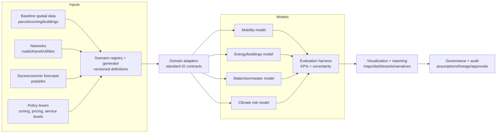

# Urban Planning — Deep Research (Operating Doc)

## Executive summary
Urban planning in a city digital twin context is the capability to explore land-use, density, infrastructure, and policy scenarios and quantify impacts *before* implementation. A planning twin integrates spatial data (parcels, zoning, networks), socioeconomic projections, and domain models (mobility, energy, water, climate risk) into a reproducible scenario framework that supports:

- Alternatives analysis with traceable assumptions
- Impact assessment (transport, emissions, affordability, service capacity)
- Equity and distributional analysis
- Stakeholder engagement with transparent narratives

The core success factor is governance and reproducibility: scenario definitions must be versioned; inputs must be documented; and model outputs must be communicated with uncertainty and limitations. A layered reference architecture—with a scenario registry, interoperable domain models, and an evaluation harness—enables incremental adoption.

This document deepens item 10 in [`kali-task-research.md`](../kali-task-research.md:1): *“Urban planning: Explore land-use, density, and infrastructure scenarios to quantify impacts before implementation.”*

---

## 1. Background and context
Planning decisions have long lifetimes and cross-domain consequences:

- Zoning and density changes alter travel demand and energy use
- Infrastructure investments create induced demand and reshape development
- Climate adaptation requirements influence siting and design standards

Planning “twin” goals:

- Replace ad-hoc spreadsheet analysis with reproducible scenario modeling
- Enable consistent comparisons (“apples to apples”) across alternatives
- Provide a defensible record for public process and audits

Challenges:

- Data fragmentation (parcels, permits, networks, demographics)
- Model coupling across domains
- Political sensitivity and risk of model misuse

---

## 2. Stakeholders
- **Planning department**: zoning, comprehensive plans, permitting policy
- **Transport agency**: mobility impacts and infrastructure needs
- **Utilities**: capacity planning for growth (energy/water)
- **Housing agency**: affordability and displacement risk
- **Elected officials**: tradeoffs, legitimacy, accountability
- **Community groups**: equity, local impacts, transparency
- **Developers**: feasibility and policy compliance
- **Environmental and resilience offices**: emissions and climate risk
- **IT/data**: platform engineering, governance

---

## 3. Threat model / abuse cases

### 3.1 Assets to protect
- Integrity and neutrality of scenario comparisons
- Confidentiality of certain development or critical infrastructure plans
- Public trust in planning analytics

### 3.2 Abuse/failure cases
- **Scenario gaming**: selectively favorable assumptions
- **Black-box modeling**: outputs used without understanding limitations
- **Equity washing**: aggregate improvements hiding localized harms
- **Data leakage** of confidential project details

### 3.3 Controls
- Scenario governance: required assumptions checklist and peer review
- Versioned scenario definitions and reproducible pipelines
- Mandatory distributional metrics and equity review
- Access controls for sensitive datasets

---

## 4. Reference architecture (components + data flows)

### 4.1 Components
1. **Scenario registry and configuration**
   - Canonical scenario objects: land use, density, infrastructure, policies
   - Versioning, authorship, approvals

2. **Baseline city data layer**
   - Parcels, zoning, land use, building stock
   - Networks: roads, transit, utilities
   - Demographics and employment distributions

3. **Domain model adapters**
   - Mobility model interface (OD, mode split, network performance)
   - Energy/buildings model interface (load/emissions)
   - Water/stormwater capacity model interface
   - Climate risk interface (hazard/exposure)

4. **Evaluation harness**
   - Standard outputs and KPI calculations
   - Uncertainty tracking and sensitivity runs

5. **Visualization and engagement**
   - Map-based scenario viewer
   - Narrative reports and comparison dashboards

6. **Governance/observability**
   - Lineage, model versioning, audit logs

### 4.2 Data flows
- Baseline datasets → scenario generator (apply zoning/land-use changes)
- Scenario state → domain models → outputs (traffic, emissions, capacity)
- Outputs → evaluation harness → KPIs and equity metrics
- Results → dashboards/reports → feedback to scenario design

### 4.3 Delivery-oriented system context (mermaid)

---

## 5. Methods / algorithms / standards

### 5.1 Land-use change modeling
- Parcel-level capacity under zoning and FAR constraints
- Development feasibility approximations (cost, rent, absorption)
- Allocation of growth to parcels via rules or optimization
- Machine learning-based development prediction (with governance; see §8)

### 5.2 Integrated transport–land use
- Activity-based models linking location choices to travel behavior
- Accessibility metrics as drivers of development patterns
- Agent-based modeling for urban dynamics

### 5.3 Infrastructure capacity and phasing
- Capacity constraints for utilities and transport
- Phasing logic: when growth triggers upgrades
- Multi-objective optimization for infrastructure planning

### 5.4 Equity and distributional analysis
- Metrics by neighborhood and protected / vulnerable population segments
- Displacement risk proxies and access-to-opportunity metrics
- Disclosure control to reduce re-identification risk (see §6.4)

### 5.5 Uncertainty and sensitivity
- Sensitivity to growth assumptions, elasticities, and policy compliance
- Use ensembles of plausible futures rather than a single forecast
- Monte Carlo / scenario ensembles for uncertainty quantification
- Robust decision making for planning under uncertainty

### 5.6 Standards and protocols
- ISO 19152 for Land Administration Domain Model (LADM)
- OGC CityGML for 3D city models
- OGC standards for geospatial planning data
- NGSI-LD for context-aware planning data sharing
- GTFS for transit data integration

---

## 6. Data requirements

### 6.1 Core datasets
- Parcel geometry, zoning, land use, assessed values
- Building footprints, height/area, age, use type
- Permits and development pipeline (with access tiering)
- Transport networks and transit service
- Population and employment distributions

### 6.2 High-value datasets
- Real estate market indicators for feasibility and calibration
- Accessibility and travel survey data for calibration
- Utility capacity constraints and planned upgrades

### 6.3 Data quality needs
- Consistent geospatial joins across datasets
- Temporal versioning (zoning changes over time)
- Metadata: source, update cadence, limitations

### 6.4 Sensitive data handling (addresses backlog gap #3)
Many planning inputs are sensitive (e.g., early development pipelines; critical infrastructure constraints). Design for tiered access and safe publication.

- **Access tiers**
  - *Internal (restricted)*: parcel-level pipeline details, critical infrastructure constraints
  - *Partner (limited)*: aggregated pipeline indicators, redacted project metadata
  - *Public*: scenario outputs and assumptions with disclosure control

- **Redaction / publication patterns**
  - Aggregate or bin sensitive values (e.g., capacity constraints by zone, not asset)
  - Time-delay publication for active negotiations
  - “Explain without exposing”: publish assumptions, not raw sensitive sources

- **Controls**
  - Row/column level security on scenario inputs
  - Output checks to prevent leakage through small-cell statistics

---

## 7. Coupling strategy and computational practicality (addresses backlog gap #4)
Cross-domain integration is essential, but the coupling style determines feasibility.

### 7.1 Coupling patterns
- **Loose coupling (recommended default)**
  - Models run independently on a shared scenario state and exchange *summary* outputs
  - Pros: simpler, cheaper, easier to validate; enables “swap models” architecture
  - Cons: misses feedback loops unless iterated

- **Iterative coupling (midpoint)**
  - Run a small number of rounds (e.g., land use → mobility → accessibility → land use)
  - Pros: captures key feedbacks with bounded cost

- **Tight co-simulation (use selectively)**
  - Synchronous co-simulation with shared time steps
  - Pros: high fidelity where needed
  - Cons: expensive, complex; harder to reproduce and explain

### 7.2 “Fast vs detailed” model ladder
- Tier A (minutes): sketch planning with elasticities, accessibility proxies
- Tier B (hours): calibrated LUTI + network assignment
- Tier C (days): high-fidelity ABM / co-simulation for flagship studies

### 7.3 Compute and cost controls
- Cache baseline layers and derived features
- Incremental recomputation (only affected geographies)
- Standardized run profiles (“public meeting quick run” vs “EIR run”)

---

## 8. Model calibration, validation, and institutional capacity (addresses backlog gap #1)

### 8.1 Calibration plan (practical)
- **Mobility calibration inputs**: counts, speeds, GTFS schedules, travel surveys, OD inference
- **Land-use calibration inputs**: parcel histories, permits, market indicators, accessibility measures
- **Energy/water calibration inputs**: building stock attributes, utility loads, seasonal patterns

### 8.2 Ownership and maintenance model
- Define a **Model Steward** for each domain (mobility, land use, utilities, climate)
- Define an **Analyst Operator** role for scenario runs and reporting
- Define an **Approver** role (planning leadership / governance board)

### 8.3 Validation workflow
- Baseline validation: reproduce current observed travel and building stock metrics
- Scenario sanity checks: capacity changes consistent with zoning rules
- Domain model validation: corridor-level travel time comparisons
- Backtesting: compare predicted development patterns to historical periods

### 8.4 Institutional capacity requirements
- Minimum: GIS engineer + data engineer + planning analyst
- Preferred: domain modelers (transport + land use) + privacy reviewer for equity slicing
- Train staff on uncertainty communication and limits of models

---

## 9. Handling contested values and political negotiation (addresses backlog gap #2)
Planning is not purely technical. The twin must make value judgments *explicit*.

### 9.1 Multi-objective decision framing
- Define a bounded set of objectives (e.g., housing units, VMT, emissions, affordability, safety)
- Document the trade-space with Pareto front / dominated alternatives

### 9.2 Governance for weights and thresholds
- Create a **Tradeoff Governance Charter**:
  - who can set weights/thresholds and when
  - what consultation is required
  - how changes are versioned and published

### 9.3 Transparent negotiation artifacts
- Publish the scenario comparison table + assumptions side-by-side
- Maintain “decision logs” linking chosen option to objectives and constraints

---

## 10. Change management into statutory planning processes (addresses backlog gap #6)
Outputs must map to statutory steps and avoid “model as authority.”

- **Where the twin plugs in**
  - Scoping: define alternatives and screening metrics
  - Draft plan / EIR/EIS: consistent baseline, documented assumptions
  - Public hearings: clear narratives + uncertainty bounds
  - Adoption and monitoring: refresh data/model; compare promised vs observed

- **Safeguards against automation bias**
  - Require human review and sign-off for policy conclusions
  - Publish limitations and non-modeled effects (qualitative impacts)
  - Use “multiple futures” rather than a single deterministic forecast

---

## 11. Observability (SLIs/SLOs)

### 11.1 SLIs
- Scenario reproducibility rate
- Data freshness for baseline datasets
- Model run success rate and time-to-results
- Digital twin synchronization metrics (DT-IRL framework)
- Model prediction accuracy for development patterns
- Cross-domain model integration consistency
- Data quality scores for planning datasets

### 11.2 Example SLOs
- Standard scenario comparisons produced within a defined planning cycle time
- Full lineage captured for every published scenario report
- System uptime ≥ 99.9%
- Model accuracy targets established per domain and tracked over time
- End-to-end latency targets defined per run profile (e.g., < 30 minutes for Tier A)

---

## 12. Risks and mitigations
- **Model complexity stalls adoption** → start with minimal KPIs; use model ladder
- **Political misuse / scenario gaming** → governance, peer review, multiple scenarios
- **Equity blind spots** → enforce neighborhood-level reporting + privacy controls
- **Confidentiality breaches** → tiered access + redaction patterns

---

## 13. Costs and FinOps
- Costs: geospatial ETL, domain model compute, staffing and training
- FinOps: cache baseline layers, incremental recomputation, cost per scenario

---

## 14. KPIs
- Time to produce defensible alternatives analysis
- Accuracy of baseline reproduction metrics
- % of planning decisions using scenario evidence
- Equity: distributional impacts included in 100% of reports

---

## 15. Deliverables and checklists (explicit)
This section is written to explicitly cover deliverables **1–11** from the user prompt.

### 15.1 Deliverables (1–11)
1. **Decision framing pack**: decisions supported, stakeholders, statutory touchpoints, and required outputs.
2. **Scenario registry** (versioned): schema + UI/API for creating, approving, and retrieving scenario definitions.
3. **Baseline data product**: canonical parcel/zoning/building/network layers with temporal versioning and metadata.
4. **Scenario generator**: transforms baseline into scenario state (zoning edits, density changes, infrastructure changes).
5. **Domain model adapter contracts**: standard IO for mobility, energy/buildings, water/stormwater, climate risk.
6. **Evaluation harness**: KPI calculations, uncertainty workflow, and sensitivity runs.
7. **Equity reporting module**: distributional metrics defaults + disclosure control rules.
8. **Calibration & validation playbook**: datasets needed, procedures, acceptance criteria, owners.
9. **Governance & audit pack**: assumptions checklist, approval workflow, lineage, and decision logs.
10. **Public engagement outputs**: redaction-safe dashboards, maps, and narrative reports.
11. **Operations runbook**: run profiles, compute/cost controls, refresh cadence, incident handling.

### 15.2 Readiness checklist
- [ ] Scenario governance process established (templates, review, approvals)
- [ ] Baseline datasets validated and versioned
- [ ] Standard KPI definitions approved and published
- [ ] Distributional reporting required by default, with disclosure control
- [ ] Calibration owners assigned per domain model
- [ ] Statutory process mapping agreed (where outputs are used)

---

## 16. References
- Workspace source: item 10 in [`kali-task-research.md`](../kali-task-research.md:1)

- External references (Firecrawl)
  - **DOE G 413.3-22, Analysis of Alternatives Guide** — https://www.directives.doe.gov/directives-documents/400-series/0413.3-EGuide-22
    - Takeaway: A government AoA playbook (aligned to GAO best practices) that emphasizes traceable requirements → alternatives → risk/cost comparison to justify preferred options in capital programs.

  - **Making Good Decisions Without Predictions: Robust Decision Making for Planning Under Deep Uncertainty (RAND, RB-9701)** — https://www.rand.org/content/dam/rand/pubs/research_briefs/RB9700/RB9701/RAND_RB9701.pdf
    - Takeaway: Describes “run analysis backward” (stress-test plans across many plausible futures) to produce robust strategies without relying on a single forecast—useful for scenario planning in contested public decisions.

  - **An Introductory Guide to Multi-Criteria Decision Analysis (MCDA) (UK Government Analysis Function)** — https://analysisfunction.civilservice.gov.uk/policy-store/an-introductory-guide-to-mcda/
    - Takeaway: A government-facing MCDA process guide (problem structuring → performance matrix → swing weighting → sensitivity analysis) that explicitly supports documenting trade-offs among non-commensurate objectives.

  - **Use of Multi-Criteria Decision Analysis in options appraisal of economic cases (UK Government, 2024)** — https://assets.publishing.service.gov.uk/media/6645e4b2b7249a4c6e9d3631/Use_of_MCDA_in_options_appraisal_of_economic_cases.pdf
    - Takeaway: Green Book–aligned note on when MCDA is appropriate (longlist appraisal) and how to keep decisions auditable by recording criteria, evidence, weights, and sensitivity results (vs. “simple scoring”).

  - **A Roadmap for Disclosure Avoidance in the Survey of Income and Program Participation — Chapter 6: Disclosure Limitation Approaches: Synthetic Data (National Academies, 2024)** — https://www.nationalacademies.org/read/27169/chapter/8
    - Takeaway: Practical overview of synthetic data as disclosure limitation (full/partial/selective synthesis), including discussion of differential privacy, attack surfaces (membership/re-identification), and validation/verification servers.

  - **COUPLING LAND-USE MODELS AND NETWORK-FLOW MODELS (U.S. DOE EEMS / SMART Mobility, Paul Waddell, 2020)** — https://www.energy.gov/sites/prod/files/2020/06/f75/eems035_waddell_2020_o_4.27.20_652PM_LT.pdf
    - Takeaway: Concrete coupling patterns for LUTI pipelines (UrbanSim + ActivitySim + network models) with emphasis on computational performance and an end-to-end workflow that supports scenario analysis at metropolitan scale.

  - **The case for microsimulation frameworks for integrated urban models (Journal of Transport and Land Use, 2018)** — https://www.jtlu.org/index.php/jtlu/article/view/1257/1153
    - Takeaway: Argues for microsimulation in integrated urban models to better represent heterogeneity and distributional impacts; discusses practical challenges and when to prefer more aggregate/“fast” models.
